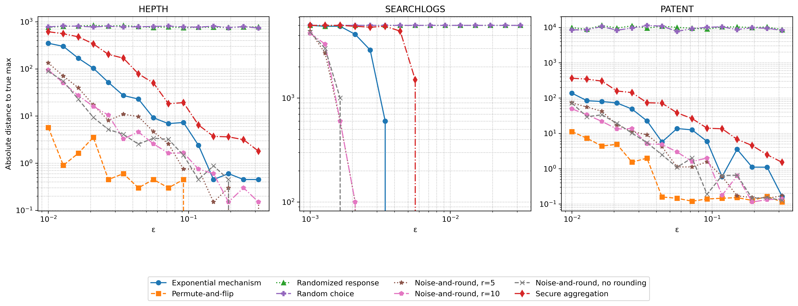

# Differentially Private Selection Mechanisms

This repository contains an implementation and comparison of various differentially private (DP) selection mechanisms, including:

- Exponential Mechanism
- Permute-and-Flip
- Noise-and-Round (with different bit precisions)
- Randomized Response
- Secure Aggregation

## Experiment

The main experiment compares the utility of different DP selection mechanisms across a range of privacy parameters (ε) on three synthetic datasets with different distributions:

- HEPTH: Exponential distribution
- SEARCHLOGS: Zipf distribution
- PATENT: Uniform distribution

The performance is measured in terms of the absolute distance between the selected value and the true maximum value.

## Results



The plot shows the performance of each mechanism as the privacy parameter epsilon (ε) increases. Lower error values indicate better utility.

## Usage

To run the experiments and generate the comparison plot:

```bash
python -m unittest tests/test_dp_mechanism_comparison.py
```

## Implementation Details

The key files in this repository are:

- `src/central/dp_mechanisms.py`: Implementations of various DP mechanisms
- `src/central/dp_selection.py`: Wrapper for DP selection mechanisms
- `src/central/noise_and_round.py`: Implementation of the Noise-and-Round mechanism
- `tests/test_dp_mechanism_comparison.py`: Benchmark test that compares mechanisms

## License

[MIT License](LICENSE) 